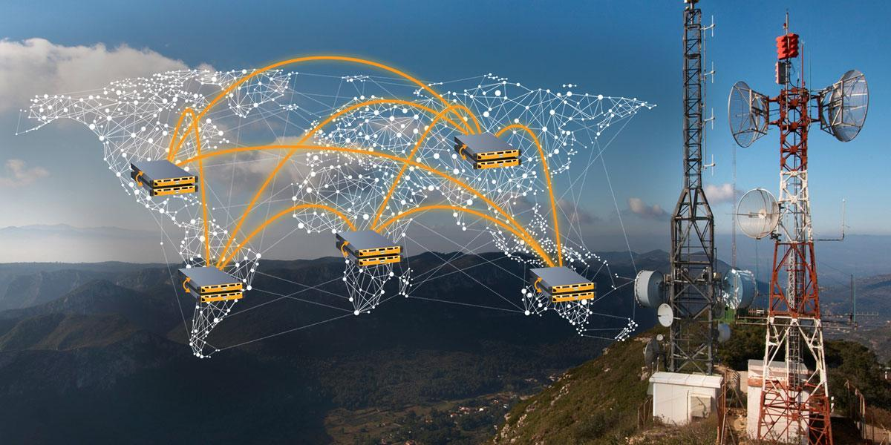
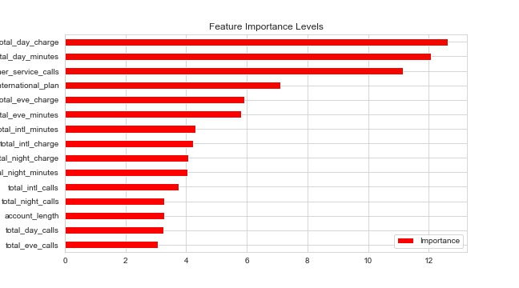

# Predicting Customer Churn in Telecommunications

#### Context:

This project aims to provide SyriaTel with a model to help predict whether a customer will soon churn. In an article about churn reduction in the telecom industry by the Database Marketing Institute, it was noted that telecom companies have an annual average churn rate between 10%-67%. The article states that "industry retention surveys have shown that while price and product are important, most people leave any service because of dissatisfaction with the way they are treated". With this in mind, we aim to highlight areas where customer service could be improved. We find in out report from this dataset, that SyriaTel has a churn rate of roughly 15% in customers who have been with the company for less than 245 days.
### Problem Statement
To investigate the different factors that contribute to the churn rate of a telecom company. The aim of this analysis is to identify potential areas to address so as to reduce the churn rate.
### Aims:

This project aims to:

    - Investigate labeled data on 3333 customers who have held accounts with the company for less than 243 days.
    - Provide inferential statistics and visualisations based on this data.
    - Create predictive, supervised learning models from the data to predict churn
    
### Definitions:

    - Churn: a customer who closes their account with SyriaTel. A prediction of True relates to a customer who will churn.
    - Predictive model: A mathemaical processes which takes in data utilizes statistics to predict outcomes. 
    
### Data:

This project utilises data from the Churn in Telecom dataset from Kaggle.

The target variable in this dataset that we aimed to predict was identified as the churn column.

The features of this dataset include locational information (state and area_code) as well as plan details such as call minutes, charges, customer services calls and whether the customer had an international plan and/or voice mail plan. Our model iterations utilised subsets of these features as well as aggregations of these features to determine which features would best predict cusomter churn.

The raw, csv dataset can be downloaded directly from the kaggle website or can be found in this repo here.

### Dependencies
python3
numpy
pandas
numpy
matplotlib
sklearn

### Models used + Methodology:

This project tests a variety of classification models including:

    - Decisioin Tree Classifier
    - Logistic Regression Classifier
    - KNN Classifier
    - Random Forest Classifer
    - Gradient Boost Classifer
    - XGB Classifier
    - Exra Tree Classifier
    
    

We evaluated our models based on the recall score metric as well as the corresponding confusion matrix. Once the best model was identified, we assessed the model performance on a seperate test set to determine whether the model continued to perform well or if the model was overfitting.

The decision behind choosing to evaluate the model on recall was made by considering the cost and impact of false negative predictions, that is, we determined that it was more costly for the company for the model to predict that a customer would stay with SyriaTel when in fact that would churn/leave. This would lead to a missed opportunity for the company to dedicate retention resources towards that customer and keeping their business. Maximising recall score accounts for this scenario in our model and so it was for this reason that we chose this as our evaluation metric.
### Descriptive Anaysis
#### Numerical feature analysis

We can see here that customer churn is a consistent rate of roughly 14-15% across all three area codes. Area code 415 has the highest number of customers but still churns the same rate as the other two area codes. For this reason, we choose to drop area code from our dataset.

* For the distribution plots of the features above, all of them except customer service calls, have a normal distribution. Total international calls seems to be skewed to the right side however it is still normally distributed.
* Customer service calls has a few peaks, which indicates there are a few modes in the population. This makes sense because customer service calls has to be a integer and not a float number.     
  
 
*Most of the features are not correlated however some do share a perfect correlation.
>* Total day charge and total day minutes features are fully positively correlated.
>* Total eve charge and total eve minutes features are fully positively correlated.
>* Total night charge and total night minutes features are fully positively correlated.
>* Total int charge and total int minutes features are fully positively correlated.
>* It makes sense for these features to be perfectly correlated because the charge is a direct result of the minutes used.
>* The perfect correlation of 1 indicates the presence of perfect multicollinearity. It does not have the same impact on nonlinear models as it does on linear models. Some nonlinear models are impacted by perfect multicollinearity whereas others are not.  
#### Categorical feature analysis
 
There appears to be a huge spike in the rate of churn for customers who make 4 or more calls to customer service. Customers who make this many calls to customer service have a churn rate over 40%. Further investigation should be devoted to looking into the other characteristics of these customers to find out why there was a need to make this many calls to customer service and how the company could better assist these customers.
### Feature Selection
 
### ROC Curve Analysis      
 
### Results, Future Investigations and Recommendations:

### Best model:
Our best model was a Random Forest model which produced an AUC of 93.7 on the test data and only 1.8% of the model's predictions on the test data were labeled as false negatives. 

The parameters of this model were:
>* max_depth=20
>* min_samples_split=5
>* n_estimators=500
>* criterion='entropy'

### Future Investigations and Recommendations:

    - Further investigation should be devoted to looking into the other characteristics of these customers to find out why there was a need to make this many calls to customer service and how the company could better assist these customers.
    - Given that over 42% of international plan holders churn, further investigation into retention efforts for these customers might be a worthwhile effort.
    - Further investigation should be done to see what is going on in these high churn states to see what trends might be causing this.
    - Investigate ways to incentivise customers with total day charges over $55 to stay with with the company by creating added value and perks. This investigation found that 100% of these customers churn.

